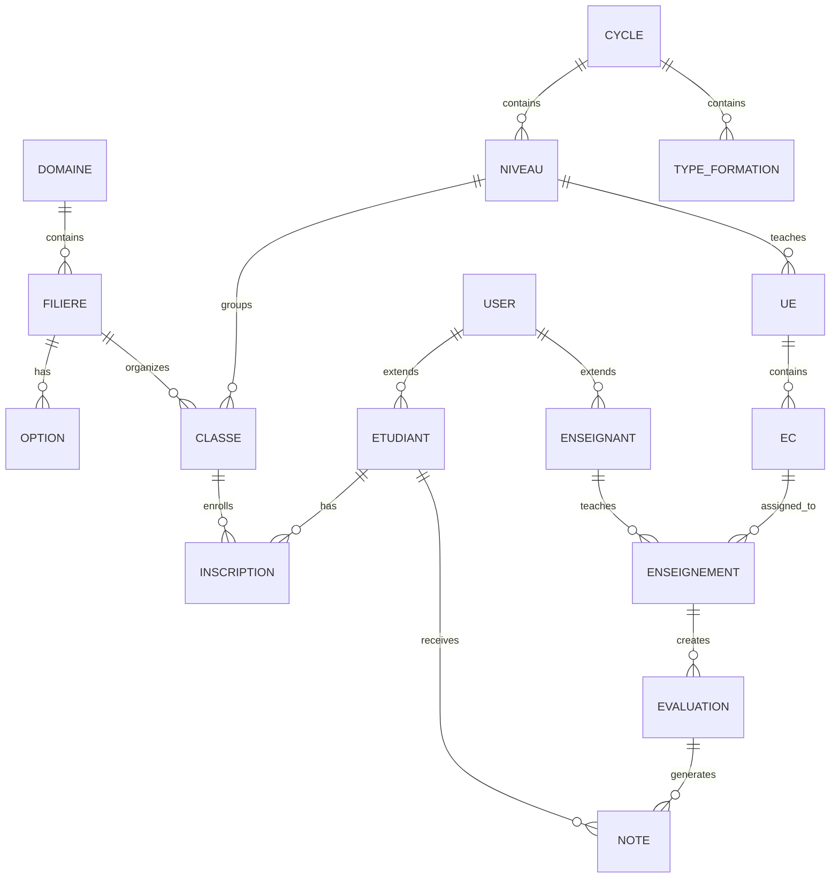

# Schéma de Base de Données
==================================================
Générée automatiquement le 01/06/2025 à 10:35

## Relations entre les modèles

## Tables principales

### domaines
**Modèle:** Domaine

| Colonne | Type | Contraintes |
|---------|------|-------------|
| filiere | ForeignKey | FK → filieres |
| id | BigAutoField | PRIMARY KEY, UNIQUE, NOT NULL |
| created_at | DateTimeField | NOT NULL |
| updated_at | DateTimeField | NOT NULL |
| nom | CharField | UNIQUE, NOT NULL |
| code | CharField | UNIQUE, NOT NULL |
| description | TextField | NOT NULL |
| actif | BooleanField | NOT NULL |

### filieres
**Modèle:** Filiere

| Colonne | Type | Contraintes |
|---------|------|-------------|
| option | ForeignKey | FK → options |
| classe | ForeignKey | FK → classes |
| id | BigAutoField | PRIMARY KEY, UNIQUE, NOT NULL |
| created_at | DateTimeField | NOT NULL |
| updated_at | DateTimeField | NOT NULL |
| nom | CharField | NOT NULL |
| code | CharField | NOT NULL |
| domaine | ForeignKey | NOT NULL, FK → domaines |
| type_formation | ForeignKey | NOT NULL, FK → types_formation |
| actif | BooleanField | NOT NULL |

### niveaux
**Modèle:** Niveau

| Colonne | Type | Contraintes |
|---------|------|-------------|
| classe | ForeignKey | FK → classes |
| ue | ForeignKey | FK → ues |
| id | BigAutoField | PRIMARY KEY, UNIQUE, NOT NULL |
| created_at | DateTimeField | NOT NULL |
| updated_at | DateTimeField | NOT NULL |
| nom | CharField | NOT NULL |
| numero | PositiveIntegerField | NOT NULL |
| cycle | ForeignKey | NOT NULL, FK → cycles |
| credits_requis | PositiveIntegerField | NOT NULL |
| actif | BooleanField | NOT NULL |

### classes
**Modèle:** Classe

| Colonne | Type | Contraintes |
|---------|------|-------------|
| enseignement | ForeignKey | FK → enseignements |
| moyennesemestre | ForeignKey | FK → moyennes_semestres |
| inscription | ForeignKey | FK → inscriptions |
| id | BigAutoField | PRIMARY KEY, UNIQUE, NOT NULL |
| created_at | DateTimeField | NOT NULL |
| updated_at | DateTimeField | NOT NULL |
| nom | CharField | NOT NULL |
| code | CharField | NOT NULL |
| filiere | ForeignKey | NOT NULL, FK → filieres |
| option | ForeignKey | FK → options |
| niveau | ForeignKey | NOT NULL, FK → niveaux |
| annee_academique | ForeignKey | NOT NULL, FK → annees_academiques |
| effectif_max | PositiveIntegerField | NOT NULL |
| active | BooleanField | NOT NULL |

### ues
**Modèle:** UE

| Colonne | Type | Contraintes |
|---------|------|-------------|
| elements_constitutifs | ForeignKey | FK → ecs |
| moyenneue | ForeignKey | FK → moyennes_ues |
| id | BigAutoField | PRIMARY KEY, UNIQUE, NOT NULL |
| created_at | DateTimeField | NOT NULL |
| updated_at | DateTimeField | NOT NULL |
| nom | CharField | NOT NULL |
| code | CharField | NOT NULL |
| credits | PositiveIntegerField | NOT NULL |
| coefficient | DecimalField | NOT NULL |
| type_ue | CharField | NOT NULL |
| niveau | ForeignKey | NOT NULL, FK → niveaux |
| semestre | ForeignKey | NOT NULL, FK → semestres |
| actif | BooleanField | NOT NULL |

### ecs
**Modèle:** EC

| Colonne | Type | Contraintes |
|---------|------|-------------|
| configurationevaluationec | ForeignKey | FK → configuration_evaluations_ec |
| enseignement | ForeignKey | FK → enseignements |
| moyenneec | ForeignKey | FK → moyennes_ecs |
| id | BigAutoField | PRIMARY KEY, UNIQUE, NOT NULL |
| created_at | DateTimeField | NOT NULL |
| updated_at | DateTimeField | NOT NULL |
| nom | CharField | NOT NULL |
| code | CharField | NOT NULL |
| ue | ForeignKey | NOT NULL, FK → ues |
| poids_ec | DecimalField | NOT NULL |
| actif | BooleanField | NOT NULL |

### users_user
**Modèle:** User

| Colonne | Type | Contraintes |
|---------|------|-------------|
| enseignant | OneToOneField | FK → enseignants |
| etudiant | OneToOneField | FK → etudiants |
| id | BigAutoField | PRIMARY KEY, UNIQUE, NOT NULL |
| password | CharField | NOT NULL |
| last_login | DateTimeField | - |
| is_superuser | BooleanField | NOT NULL |
| username | CharField | UNIQUE, NOT NULL |
| first_name | CharField | NOT NULL |
| last_name | CharField | NOT NULL |
| email | CharField | NOT NULL |
| is_staff | BooleanField | NOT NULL |
| is_active | BooleanField | NOT NULL |
| date_joined | DateTimeField | NOT NULL |
| type_utilisateur | CharField | NOT NULL |
| matricule | CharField | UNIQUE, NOT NULL |
| telephone | CharField | NOT NULL |
| adresse | TextField | NOT NULL |
| date_naissance | DateField | - |
| lieu_naissance | CharField | NOT NULL |
| photo | FileField | - |
| actif | BooleanField | NOT NULL |
| groups | ManyToManyField | NOT NULL, FK → auth_group |
| user_permissions | ManyToManyField | NOT NULL, FK → auth_permission |

### etudiants
**Modèle:** Etudiant

| Colonne | Type | Contraintes |
|---------|------|-------------|
| note | ForeignKey | FK → notes |
| moyenneec | ForeignKey | FK → moyennes_ecs |
| moyenneue | ForeignKey | FK → moyennes_ues |
| moyennesemestre | ForeignKey | FK → moyennes_semestres |
| inscription | ForeignKey | FK → inscriptions |
| historiquestatut | ForeignKey | FK → historique_statuts |
| id | BigAutoField | PRIMARY KEY, UNIQUE, NOT NULL |
| created_at | DateTimeField | NOT NULL |
| updated_at | DateTimeField | NOT NULL |
| user | OneToOneField | UNIQUE, NOT NULL, FK → users_user |
| numero_carte | CharField | UNIQUE, NOT NULL |
| statut_current | CharField | NOT NULL |

### inscriptions
**Modèle:** Inscription

| Colonne | Type | Contraintes |
|---------|------|-------------|
| id | BigAutoField | PRIMARY KEY, UNIQUE, NOT NULL |
| created_at | DateTimeField | NOT NULL |
| updated_at | DateTimeField | NOT NULL |
| etudiant | ForeignKey | NOT NULL, FK → etudiants |
| classe | ForeignKey | NOT NULL, FK → classes |
| annee_academique | ForeignKey | NOT NULL, FK → annees_academiques |
| date_inscription | DateField | NOT NULL |
| statut | ForeignKey | NOT NULL, FK → statuts_etudiant |
| nombre_redoublements | PositiveIntegerField | NOT NULL |
| active | BooleanField | NOT NULL |

### evaluations
**Modèle:** Evaluation

| Colonne | Type | Contraintes |
|---------|------|-------------|
| note | ForeignKey | FK → notes |
| id | BigAutoField | PRIMARY KEY, UNIQUE, NOT NULL |
| created_at | DateTimeField | NOT NULL |
| updated_at | DateTimeField | NOT NULL |
| nom | CharField | NOT NULL |
| enseignement | ForeignKey | NOT NULL, FK → enseignements |
| type_evaluation | ForeignKey | NOT NULL, FK → types_evaluation |
| session | ForeignKey | NOT NULL, FK → sessions |
| date_evaluation | DateField | NOT NULL |
| note_sur | DecimalField | NOT NULL |
| coefficient | DecimalField | NOT NULL |
| saisie_terminee | BooleanField | NOT NULL |

### notes
**Modèle:** Note

| Colonne | Type | Contraintes |
|---------|------|-------------|
| id | BigAutoField | PRIMARY KEY, UNIQUE, NOT NULL |
| created_at | DateTimeField | NOT NULL |
| updated_at | DateTimeField | NOT NULL |
| etudiant | ForeignKey | NOT NULL, FK → etudiants |
| evaluation | ForeignKey | NOT NULL, FK → evaluations |
| note_obtenue | DecimalField | NOT NULL |
| absent | BooleanField | NOT NULL |
| justifie | BooleanField | NOT NULL |
| commentaire | TextField | NOT NULL |

### moyennes_ues
**Modèle:** MoyenneUE

| Colonne | Type | Contraintes |
|---------|------|-------------|
| id | BigAutoField | PRIMARY KEY, UNIQUE, NOT NULL |
| created_at | DateTimeField | NOT NULL |
| updated_at | DateTimeField | NOT NULL |
| etudiant | ForeignKey | NOT NULL, FK → etudiants |
| ue | ForeignKey | NOT NULL, FK → ues |
| session | ForeignKey | NOT NULL, FK → sessions |
| annee_academique | ForeignKey | NOT NULL, FK → annees_academiques |
| moyenne | DecimalField | NOT NULL |
| credits_obtenus | PositiveIntegerField | NOT NULL |
| validee | BooleanField | NOT NULL |
